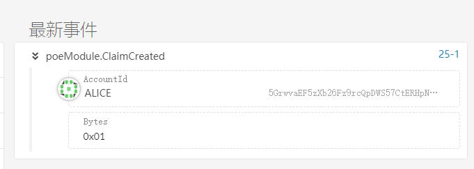
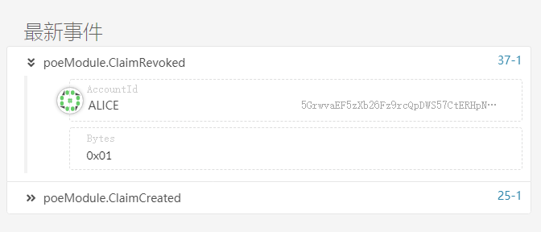
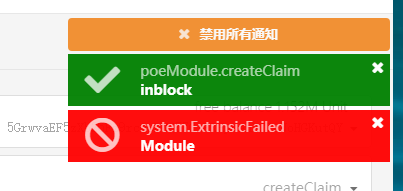

## 第一题：实现存证模块的功能，包括：
节点运行:

创建存证，可调用函数所接收参数为内容的哈希值 Vec；

撤销存证，可调用函数所接收参数为内容的哈希值 Vec。

第二题：为存证模块添加新的功能，

转移存证，接收两个参数，一个是内容的哈希值，另一个是存证的接收账户地址；当存证不存在或者发送请求的用户不是存证内容的拥有人时，返回错误；当所有的检查通过后，更新对应的存证记录，并触发一个事件。

第三题（附加题）：

创建存证时，为存证内容的哈希值设置界限，如果超出界限，返回错误。

